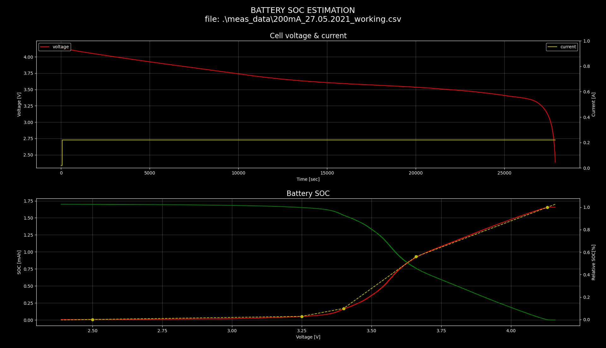

# Battery SOC estimation
Python script for linear approximation of battery SOC based on voltage measurement only. Scripts inputs battery cell voltage measurement during constant current discharge.


### Configuration
Select number of points to perform linear approximation at the start of sript:

```python
# Find points at certain voltage
# NOTE: In decending value as acquire by measurement
VOLT_POINT = [ 4.13, 3.66, 3.40, 3.25, 2.5 ]
VOLT_POINT_EPS = 0.005
```

User can change "VOLT_POINT" array, remove or add additional point for interpolation. 

### Requirements

All script requirements are listed in **requirements.txt**

Install it via pip:
```python
>>>pip install -r requirements.txt
```

### Example of invocation
```python
>>>py bat_soc_est.py -f meas_data\200mA_27.05.2021_working.csv
```

### Script outputs

Calculated linear coefficients and inital value for given example (as pairs):

```python
k: [0.9333726963064314, 1.7743934458548243, 0.4711244213113143, 0.037018631374283406]
n: [-2.8556498619062087, -5.9337858052533266, -1.5026711218053928, -0.09182730451004238]

# Use it as between specified voltage range (look at the sript configuration)!
SoC(cell_vol) = k * cell_vol + n

# Where output is in range from 0 - 1.0!

```

- FIRST PLOT:
Cell voltage and current during constatn current (CC) discharge.

- SECOND PLOT:
Yellow dashed line is interpolation of battery SOC and yellow points are specified as sript configuration. Green line is actual SOC level in respect to cell voltage during CC disharge.


